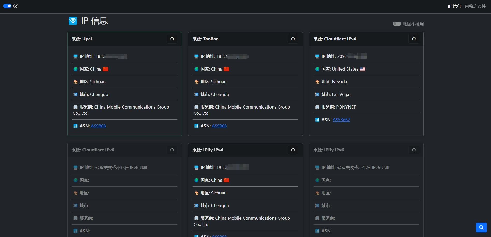
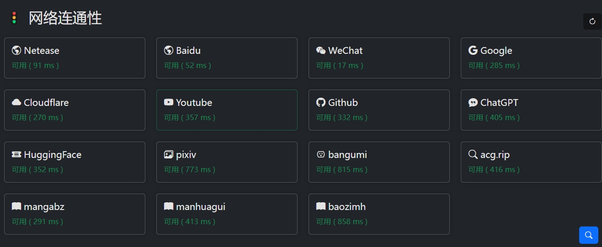

# 可达性检测


## 说明

偶然发现了更好的开源项目[MyIP](https://github.com/lissettecarlr/ReachabilityCheck/releases)，之前版本宣告破产，之后该仓库将使用MyIP，进行一些私有化修改。

[历史版本](https://github.com/lissettecarlr/ReachabilityCheck/releases)，界面如下图:


[当前版本]()，界面如下图：





## 修改连通性测试的站点

在`src/res/app.js`中修改`connectivityTests`，示例如下：
```js
    {
        id: 'HuggingFace',
        name: 'HuggingFace',
        icon: 'ticket-detailed-fill',
        url: 'https://huggingface.co/front/assets/huggingface_logo-noborder.svg?',
        status: ''
    }
```
其中icon图标在[getbootstrap](https://icons.getbootstrap.com/)中选取。
url和之前那个版本一样，也是选取目标站点中的一个图片，通过加载图片来判断连通性。

## 使用docker运行

生成镜像
```bash
sudo docker build -t reachability-check .
```

启动容器
```bash
sudo docker run -d -p 2222:80 reachability-check
```

访问`127.0.0.1:2222`


可以直接使用我的镜像
```bash
sudo docker run -d -p 2222:80 lissettecarlr/reachability-check:latest --name reachability
```


## 上传镜像到hub
如果想在自定义镜像后，方便其他设备使用，则可以将镜像上传到自己的hub

生成需要上传的镜像，名字格式:`<your-dockerhub-username>/<image-name>:<tag>`
```bash
sudo docker build -t lissettecarlr/reachability-check:v0.1 .
```

登录hub
```bash
docker login
```

上传镜像
```bash
sudo docker push lissettecarlr/reachability-check:v0.1
```

后续迭代
```bash
sudo docker build -t lissettecarlr/reachability-check:v0.2 .
sudo docker tag lissettecarlr/reachability-check:v0.1 lissettecarlr/reachability-check:v0.2
sudo docker push lissettecarlr/reachability-check:v0.2
```