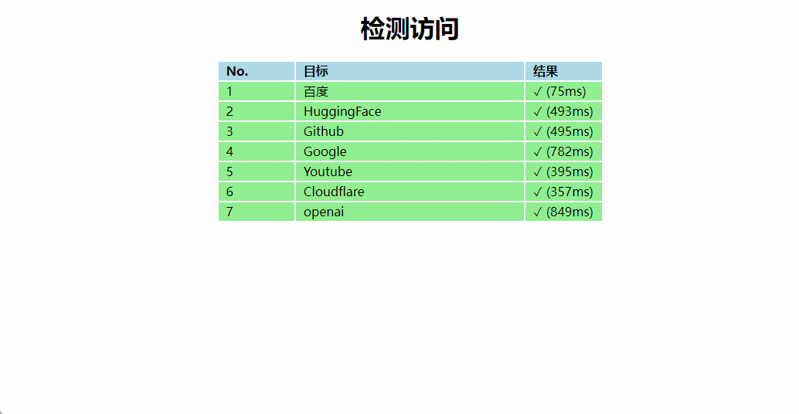

# 可达性检测

## 说明

该工具是用来检测对一些特定网站的访问情况。由于目前使用的代理会出现节点1能够访问A、B但是不能访问C，节点2能够访问A、C但是不能访问B的这种无语情况，所以有了这个工具。

## 使用

进入src目录，双击`index.html`即可。

## 配置

该工具是根据[can-i-reach-google](https://github.com/flowmemo/can-i-reach-google)修改

需要增加网站就直接在`script.js`中的`rows`变量中添加即可。其中checkImg是目标网站中的随便一张图片，就是通过加载它来判断是否能够访问。而url只是显示的名称而已。

